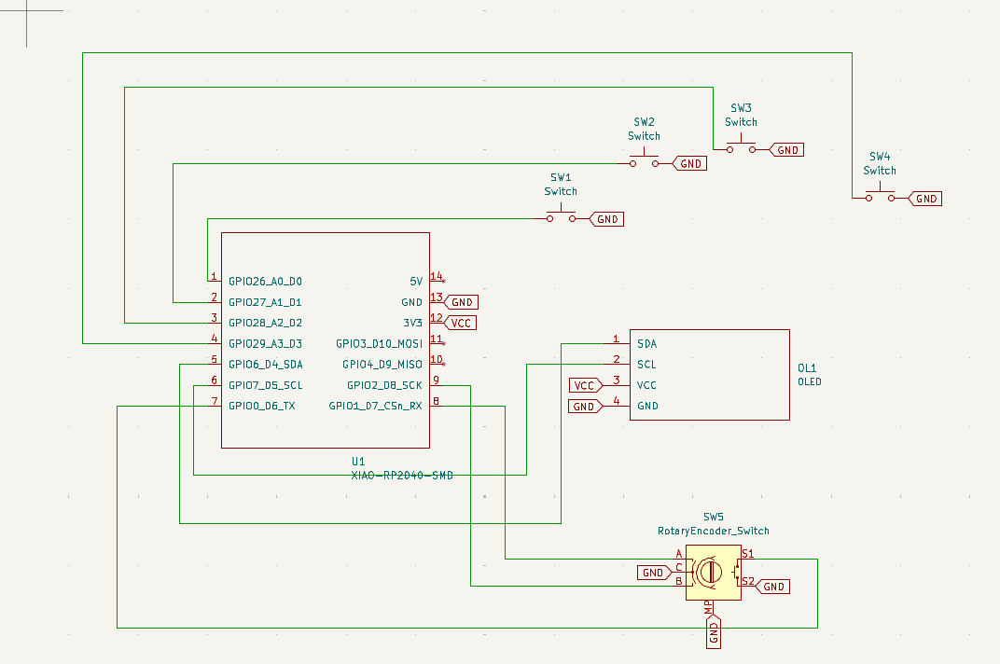
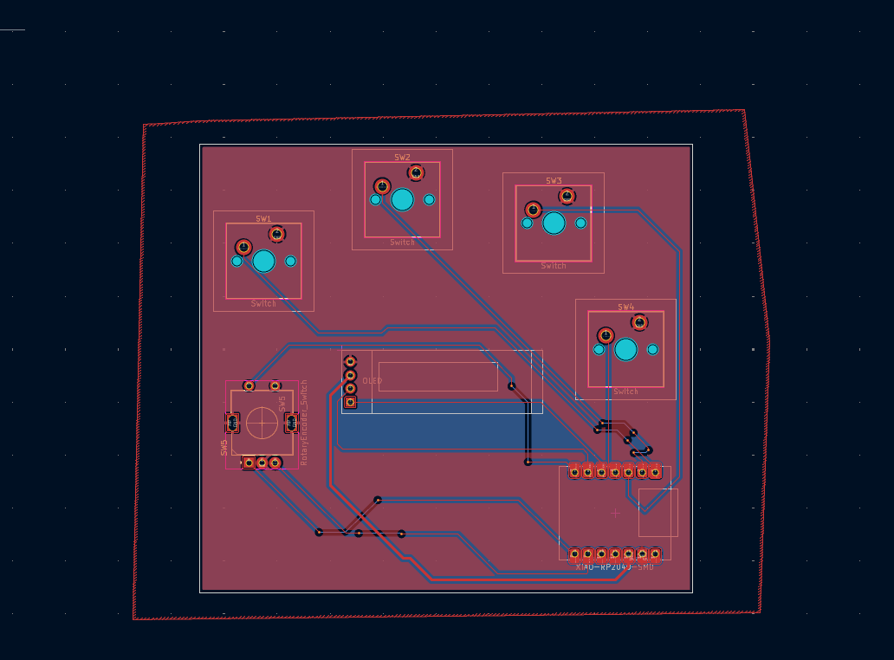
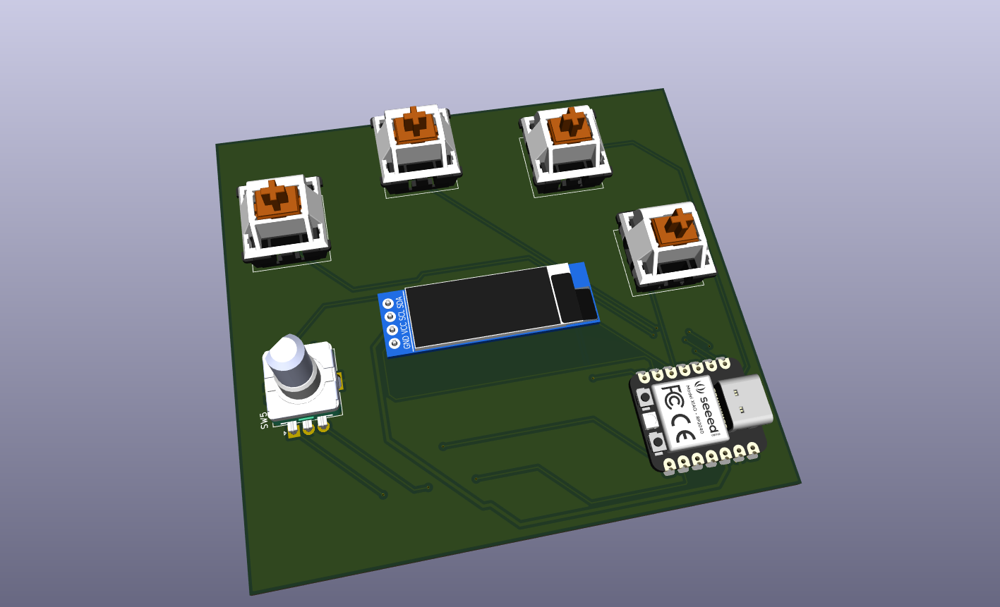
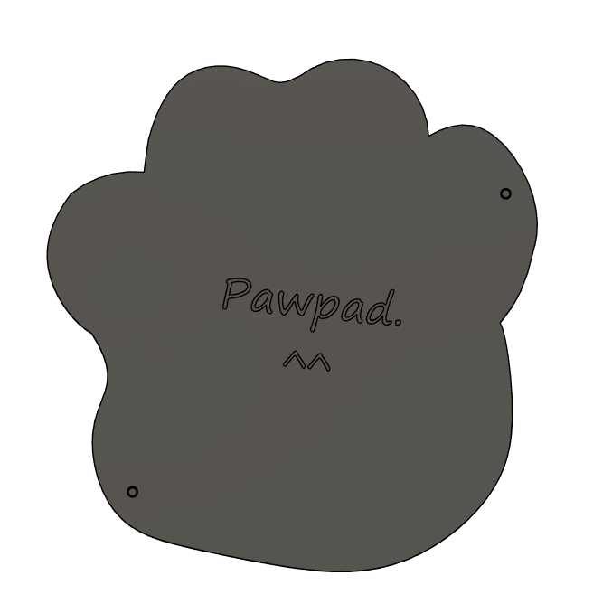

# Purrfect-Pad
A hackclub project Submission
A minimalist - cool looking (allegedly) macropad for cat lovers and productive people.

## Features
* **Custom 4-Key Mechanical Layout:** 
* **Integrated OLED Display:** 128x32 screen for status and animations
* **Cool Asthetic** People fond of cats need a paw on their desk all the time!
* **Rotary Encoder:** Precision control for volume 
* **XIAO RP2040 Powered:** Compact and powerful processing

## Schematic

## PCB

## 3D Model Case

## BOM 
* 1x Seeed Studio XIAO RP2040
* 1x 0.91" SSD1306 OLED Display (128x32)
* 4x Mechanical Switches 
* 1x Rotary Encoder
* 4x M3 x 16mm Socket Head Cap Screws
* 3D Printed Case

## Note
Making the pawpad was awsome. Always wanted to get into 3d modelling and making something tangable instead of my projects just being a concept. Wasnt execting to take as much time it took to finish the pawpad completly. I learned a lot of Fusion 360 and PCB designing :> looks like Ill be making more of my projects tangible.